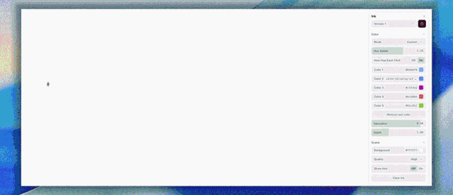

# Ink on Click

Click and drag watercolor ink for the web. WebGL2, no dependencies.

Ink drops where you press, blooms outward with a soft, crinkled watercolor edge, mixes with other colors like real pigment, then slowly washes back to white.



**[Live demo](https://ink-on-click.vercel.app/)** · **[Download the single file](dist/ink-on-click.html)**

---

## Try it in 10 seconds

Download [`dist/ink-on-click.html`](dist/ink-on-click.html) and open it in Chrome, Safari, Firefox or Edge. Everything is inside that one file, including the settings panel, so it works offline.

## Use it in your project

Copy [`src/ink.js`](src/ink.js) into your project. It is one file with no dependencies.

```html
<canvas id="ink" style="position:fixed; inset:0; width:100%; height:100%"></canvas>

<script type="module">
  import { createInk } from "./ink.js";

  const ink = createInk(document.getElementById("ink"), {
    mode: "custom",
    colors: ["#ff2d55", "#1e6bff"],
  });
</script>
```

The canvas fills whatever size you give it with CSS, and it handles resizing and retina screens by itself.

### Change settings live

```js
ink.set({ size: 40, fadeSpeed: 0.5 });
ink.clear();           // wipe all ink
ink.drop(0.5, 0.5);    // drop ink from code (x, y from 0 to 1, top left origin)
ink.destroy();         // stop and free GPU memory
```

### React

```jsx
import { useEffect, useRef } from "react";
import { createInk } from "./ink.js";

export function Ink(props) {
  const ref = useRef(null);
  useEffect(() => {
    const ink = createInk(ref.current, props);
    return () => ink.destroy();
  }, []);
  return <canvas ref={ref} style={{ width: "100%", height: "100%", display: "block" }} />;
}
```

## Options

| Option | Default | What it does |
| --- | --- | --- |
| **Brush** | | |
| `size` | `23` | Brush radius in pixels |
| `inkAmount` | `1.8` | How much ink each stroke drops |
| `holdInk` | `1.05` | Ink added while you hold the pointer still |
| `flow` | `0` | How much a fast drag pushes the ink around |
| **Spread** | | |
| `bloom` | `1.2` | How far wet ink creeps outward |
| `spreadSpeed` | `0.55` | How fast it creeps |
| `edgeRoughness` | `0.85` | How much the paper grain breaks up the edge |
| `edgeSoftness` | `0.89` | How much colors blend inside a stain |
| `grain` | `8` | Size of the edge detail, higher is finer |
| `turbulence` | `2.25` | Billowing motion inside the ink |
| `swirl` | `23` | Curls and eddies |
| **Fade** | | |
| `fadeSpeed` | `0.22` | How quickly ink washes away |
| `settle` | `6` | How quickly motion calms down |
| **Color** | | |
| `mode` | `"rainbow"` | `"rainbow"` or `"custom"` |
| `colors` | `["#ff2d55", "#ffb800"]` | Your palette for custom mode, any CSS colors |
| `hueSpeed` | `2.35` | How fast color changes while dragging. Use `0` for one steady color |
| `newHueEachClick` | `true` | Each click starts at a random color |
| `saturation` | `0.9` | Color intensity. At `0.9` custom colors show exactly as picked |
| `depth` | `1` | Overall ink strength |
| **Scene** | | |
| `background` | `"#ffffff"` | Paper color |
| `quality` | `"high"` | `"low"`, `"medium"` or `"high"`. Use low on older phones |
| `interactive` | `true` | Listen to mouse and touch on the canvas |
| `maxPixelRatio` | `2` | Caps resolution on very dense screens |

## How it works

1. **Fluid:** a small stable fluids simulation moves the ink as you drag.
2. **Bloom:** wet ink creeps outward each frame, and a noise "paper grain" texture slows it in some places, which creates the cauliflower edge.
3. **Color:** ink is stored as pigment absorbance, not RGB, so overlapping colors darken and mix like real ink instead of glowing.

## Playground

The demo in [`demo/index.html`](demo/index.html) has a live settings panel built with [DialKit](https://github.com/joshpuckett/dialkit) by Josh Puckett. Tune the look there, then copy the values into your `createInk` options.

To run it locally:

```bash
npx serve .
# open http://localhost:3000/demo/
```

To rebuild the single file after editing:

```bash
npm install
npm run build
```

## Project structure

```
src/ink.js                the effect, the only file you need
demo/index.html           playground with the DialKit panel
dist/ink-on-click.html    everything in one file, works offline
scripts/build.mjs         builds the single file
```

## Browser support

Any browser with WebGL2: Chrome, Edge, Firefox, Safari 15 and newer, on desktop and mobile.

## Credits

Settings panel by [DialKit](https://github.com/joshpuckett/dialkit) (MIT) by Josh Puckett.
Fluid solver approach inspired by Jos Stam's "Stable Fluids".

## License

MIT © Chintan, [chintanned.com](https://chintanned.com)
